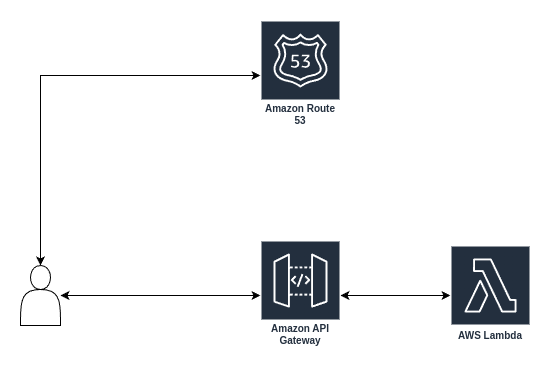

# Regional api gateway with custom domain

Terraform resources for regional api gateway with custom resources.

Requirements:
- terraform
- domain
- route 53 zone

Services:
- route 53
- api gateway
- lambda function

