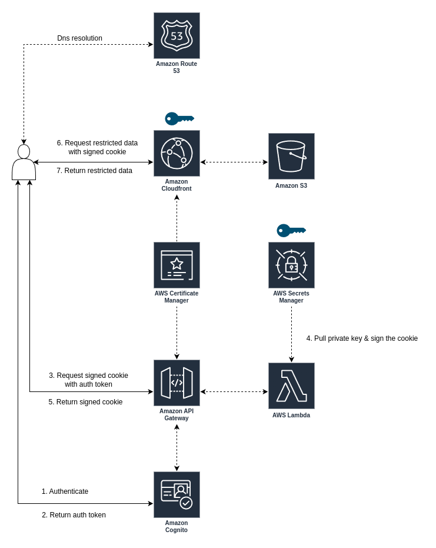

# Cloudfront Secure Video Media Distribution

Cloudfront project with restricting access with signed cookies.

Requirements:
- domain
- route 53 zone id
- terraform

Services:
- route 53
- cloudfront
- s3
- certificate manager
- secrets manager
- api gateway
- lambda
- cognito

#### Architecture

<p align="center"></p>

Cloudfront is configured with public and private content.
Private content is secured with signed cookies using public key cryptography.
Private key is stored in secrets manager and public key is stored in cloudfront key group.

To get signed cookies first user authenticates with cognito to get auth token.
User uses that auth token to request signed cookie from api gateway lambda.
Lambda pulls private key from secrets manager and signs cookie data needed to access the private content.

After getting the signed cookie user requests private data from cloudfront.
Cloudfront validates that the signature is correct and returns the data to the user.

Route 53 is used so that cloudfront and api gateway share the domain since lambda function for signing cookies is setting cookie `Domain` attribute.
Otherwise most clients would throw an security exception.

Public and private keys are RSA 2046 key in `pkcs#1` format.
Unfortunately cloudfront does not support kms for signed cookies so they have to be manually managed.
Keys are generated as part of terraform but if you are generating them yourself use following commands.
```bash
openssl genrsa -traditional -out private_key.pem && \
openssl rsa -pubout -in private_key.pem -out public_key.pem
```

#### Deployment

Before starting populate values in `infrastructure/values.auto.tfvars`.
Make sure that `test_user_username` and `test_user_password` match `TEST_USER` and `TEST_PASSWORD` values below.

```bash
# deploy the infrastructure
make deploy
pushd infrastructure

# populate username and password
TEST_USER='testuser'
TEST_PASSWORD='testpassowrD1234!'

# get output information
USER_POOL_CLIENT_ID=$(terraform output -json | jq  -r '.user_pool_client_id.value')
CDN_CUSTOM_DOMAIN_NAME=$(terraform output -json | jq  -r '.cdn_custom_domain_name.value')
MEDIA_BUCKET_NAME=$(terraform output -json | jq  -r '.media_bucket_name.value')
API_URL=$(terraform output -json | jq  -r '.api_custom_domain_name.value')


# upload public and private content
aws s3 cp ../assets/cute-cat.jpg "s3://$MEDIA_BUCKET_NAME/public/"
aws s3 cp ../assets/super-cute-cat.jpg "s3://$MEDIA_BUCKET_NAME/private/"

# try to retrieve private content - should fail
curl -v -G "$CDN_CUSTOM_DOMAIN_NAME/private/super-cute-cat.jpg"

# try to retrieve public content - should succeed
curl -v -G "$CDN_CUSTOM_DOMAIN_NAME/public/cute-cat.jpg" --output cat.jpg


# retrieve auth token
TOKEN=$(aws cognito-idp initiate-auth --auth-flow USER_PASSWORD_AUTH \
--auth-parameters "USERNAME=$TEST_USER,PASSWORD=$TEST_PASSWORD" \
--client-id $USER_POOL_CLIENT_ID \
--query "AuthenticationResult.IdToken" --output text --region us-east-1)

# get signed cookies
curl -i -G -c cookie.txt -H "Authorization: Bearer $TOKEN" "$API_URL/signed-cookies"

# send reguest with signed cookies
curl -v -b cookie.txt -G "$CDN_CUSTOM_DOMAIN_NAME/private/super-cute-cat.jpg" --output super-cute-cat.jpg

# cleanup
popd
make clean
```
