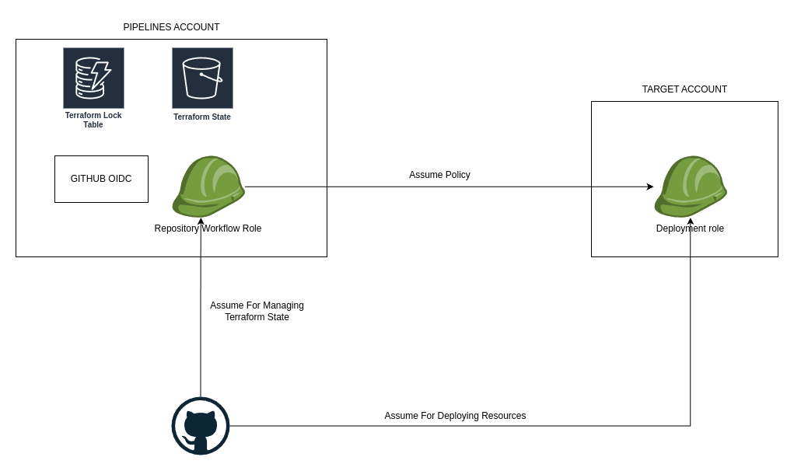

# Pipelines

Resources for deploying ci/cd pipelines with github actions and terraform.
For more details see the [blog post](https://www.itguyjournals.com/multi-account-cloud-deployment-with-terraform-and-github-actions/).

Files:
- `pipelines-resources.sam.yaml`: terraform bucket, terraform lock table and github oidc provider
- `target-account-assume-role.sam.yaml`: role in target account for deploying resources
- `pipelines-workflow-role.sam.yaml`: repository specific role for workflows

## Architecture

<p align="center"></p>


When github workflow is started first it will assume role in pipelines account.
Role has permissions to access terraform state bucket and lock table.
It also has access to assume role in target account for deployment.

Example of github workflow is below.

```yaml
name: Example pipeline

on:
  push:
    branches: [ main ]
  workflow_dispatch: {}

env:

  AWS_REGION : "<REGION>"
  AWS_PIPELINES_ROLE_ARN: "<PIPELINES ROLE ARN>"

# Permission can be added at job level or workflow level
permissions:
      id-token: write   # This is required for requesting the JWT
      contents: read    # This is required for actions/checkout
jobs:
  AssumeRoleAndCallIdentity:
    runs-on: ubuntu-latest
    steps:
      - name: clone the repository
        uses: actions/checkout@v4

      - name: configure aws credentials
        uses: aws-actions/configure-aws-credentials@v4
        with:
          role-to-assume: ${{ env.AWS_PIPELINES_ROLE_ARN }}
          aws-region: ${{ env.AWS_REGION }}

      - name: apply terraform configuration
        run: |
          terraform init

          terraform workspace new sandbox || true
          terraform workspace select sandbox

          terraform plan
          terraform apply -auto-approve
          # terraform destroy -auto-approve
```

Terraform commands with execute with pipelines account permissions.
Terraform aws provider is configured to assume the role from target account to be able to deploy resources there.
Example of terraform configuration is below.

```terraform
terraform {
  backend "s3" {
    bucket         = "<STATE BUCKET NAME>"
    key            = "test-app/terraform.tfstate"
    region         = "<REGION>"
    dynamodb_table = "<LOCK TABLE NAME>"
  }

  required_providers {
    aws = {
      source  = "hashicorp/aws"
      version = "~> 5.0"
    }
  }
}

provider "aws" {
  region = "<REGION>"
  assume_role {
    role_arn = "<TARGET ACCOUNT ROLE ARN>"
  }
}
```
